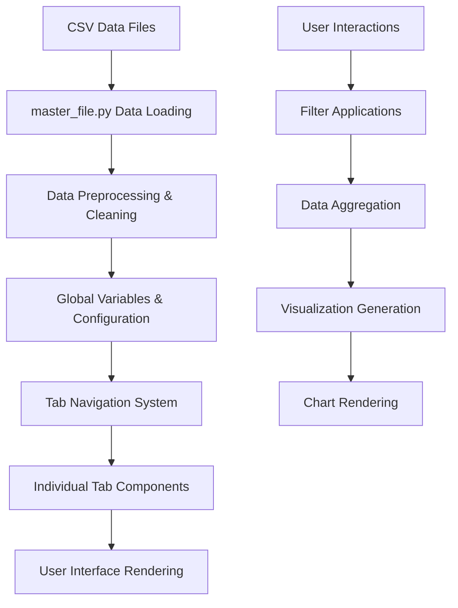

# Technical Reference Guide - GenX Exposure Study Dashboard

## Code Architecture Deep Dive

### Data Flow Architecture



### Core Functions Reference

#### master_file.py Functions

```python
def read_python(file_path):
    """
    Dynamically loads and executes Python files for each tab.
    
    Args:
        file_path (str): Path to Python file to execute
        
    Note: Uses exec() to run code in current namespace,
          allowing access to global variables
    """

def adjust_box_widths(g, fac):
    """
    Legacy function for Seaborn boxplot width adjustment.
    
    Args:
        g: Seaborn plot object
        fac (float): Width adjustment factor
        
    Note: No longer used with Altair implementation
    """
```

#### Home.py Functions

```python
def summary_stats(location, summary_data, color):
    """
    Generates demographic summary visualizations for a specific location.
    
    Args:
        location (str): Location name ('Pittsboro', 'Fayetteville', 'Lower Cape Fear Region')
        summary_data (pd.DataFrame): Complete dataset
        color (list): Color scheme for charts (single color in list format)
        
    Returns:
        None (displays charts directly via Streamlit)
        
    Charts Generated:
        - Age distribution (horizontal bar chart)
        - Gender distribution (pie chart)
        - Years lived in community (horizontal bar chart)
        
    Data Processing:
        - Filters to 2023 data only
        - Calculates percentages rounded to integers
        - Handles empty data gracefully
    """
```

#### View Individual PFAS.py Functions

```python
def pfas_by_row(pfas_list, y_max, df_plot_adjusted, plot_years_numeric, 
                plot_years_formatted, loc_order, selected_years, num_cols=3):
    """
    Creates individual PFAS analysis visualizations in a grid layout.
    
    Args:
        pfas_list (list): List of PFAS chemicals to visualize
        y_max (float): Maximum y-axis value for consistency
        df_plot_adjusted (pd.DataFrame): Processed data with quantiles
        plot_years_numeric (list): Numeric year values
        plot_years_formatted (list): Formatted year labels
        loc_order (list): Location display order
        selected_years (list): Years selected by user
        num_cols (int): Number of columns in grid layout
        
    Visualization Features:
        - Custom Altair boxplots
        - Location-based color coding
        - NHANES reference lines
        - Responsive grid layout
        - Consistent styling across charts
    """

def format_year_label(year):
    """
    Converts year values to abbreviated display format.
    
    Args:
        year (int): Year value (e.g., 2019)
        
    Returns:
        str: Formatted year ('19 for 2019, 2017 for 2017, 2023 for 2023)
        
    Format Rules:
        - 2017, 2023: Display full year
        - 2018-2022: Display as '18, '19, '20, '21, '22
    """
```

#### View by Location.py Functions

```python
def view_by_location(pfas_range, predefined_order, selected_locations, y_max, 
                     ax, df_plot_adjusted, plot_years_numeric, 
                     plot_years_formatted, selected_years=None):
    """
    Creates location-centered PFAS visualization grid.
    
    Args:
        pfas_range (list): PFAS chemicals in concentration range
        predefined_order (list): Display order for PFAS
        selected_locations (list): Locations to display
        y_max (float): Maximum y-axis value
        ax (str): Axis identifier (legacy parameter)
        df_plot_adjusted (pd.DataFrame): Processed data
        plot_years_numeric (list): Numeric years
        plot_years_formatted (list): Formatted year labels
        selected_years (list): Selected years for filtering
        
    Layout:
        - 3-column grid for locations
        - Center single location in middle column
        - Consistent styling across all charts
    """
```

#### View Summed PFAS.py Functions

```python
def process_nhanes_raw_data(raw_data_path="P_PFAS.xlsx - Sheet1.csv"):
    """
    Processes raw NHANES PFAS data for national comparison.
    
    Args:
        raw_data_path (str): Path to raw NHANES data file
        
    Returns:
        pd.DataFrame: Processed NHANES data with summed NASEM 7 concentrations
        
    Processing Steps:
        1. Load raw NHANES data
        2. Map column names to PFAS chemicals
        3. Apply detection flags
        4. Sum NASEM 7 chemicals per participant
        5. Apply survey weights
        
    NHANES Column Mapping:
        - LBXPFDE: PFDA
        - LBXPFHS: PFHxS
        - LBXPFNA: PFNA
        - LBXPFUA: PFUnDA
        - LBXNFOA/LBXBFOA: PFOA (linear/branched)
        - LBXNFOS: PFOS
        - LBXMFOS: MeFOSAA
    """
```

### Data Structure Specifications

#### Primary Dataset Schema (complete DataFrame)

```python
# Core columns after preprocessing
{
    'unique_id': str,           # Participant identifier (id_community)
    'Location': str,            # Study location
    'Year': int,                # Study year
    'PFAS': str,               # PFAS chemical name
    'conc': float,             # Concentration (ng/mL)
    'detect': int,             # Detection flag (0/1)
    'age_cat': str,            # Age category
    'gender': str,             # Gender
    'years_lived_cat': str,    # Years lived in community
    'hispanic': str,           # Ethnicity
    
    # Computed columns
    '5th percentile': float,
    '25th percentile': float,
    '50th percentile': float,
    '75th percentile': float,
    '95th percentile': float,
    'conc_adjusted': float     # Outlier-clipped concentration
}
```

#### NHANES Reference Data Schema

```python
{
    'pfas': str,               # PFAS chemical name
    'median': float,           # Median concentration (ng/mL)
    '95th_percentile': float   # 95th percentile reference value
}
```

### Visualization Specifications

#### Altair Boxplot Implementation

```python
# Custom boxplot components
components = {
    'box': 'mark_bar()',           # 25th-75th percentile rectangle
    'median_line': 'mark_tick()',  # Median indicator
    'whiskers': 'mark_rule()',     # 5th-95th percentile lines
    'min_tick': 'mark_tick()',     # 5th percentile indicator
    'max_tick': 'mark_tick()'      # 95th percentile indicator
}

# Consistent styling parameters
styling = {
    'stroke': 'black',             # Border color
    'strokeWidth': 1,              # Border width
    'opacity': 0.7,               # Fill transparency
    'size': 8,                    # Component size
    'thickness': 1                # Line thickness
}
```

#### Color Scheme Management

```python
# Location colors (consistent across all visualizations)
location_colors = {
    'Pittsboro': "#44a482",              # Teal
    'Fayetteville': '#d47200',           # Orange  
    'Lower Cape Fear Region': "#5e76a7"  # Blue
}

# PFAS colors (by concentration range)
large_range_colors = {
    'PFOS': "#85AB3D",     # Green
    'PFOA': "#e49763",     # Orange
    'PFO5DoA': "#7bb594"   # Light green
}

medium_range_colors = {
    'PFHxS': "#9ca4ce",              # Light blue
    'PFNA': "#e08617",               # Orange
    'Nafion byproduct 2': "#f7c7c7"  # Light pink
}

small_range_colors = {
    'PFDA': '#5e76a7',     # Blue
    'PFUnDA': "#47907F",   # Teal
    'MeFOSAA': "#90a286"   # Sage green
}
```

### Performance Optimization Patterns

#### Data Filtering Strategy

```python
# Sequential filtering for performance
def optimize_data_filtering(data, locations, pfas_list, years):
    """
    Applies filters in order of selectivity to minimize processing.
    
    Order of operations:
    1. Location filter (most selective)
    2. PFAS filter (moderately selective)  
    3. Year filter (least selective)
    4. Detection rate filter (computationally expensive)
    5. Group size filter (final validation)
    """
    
    # Step 1: Basic filters
    filtered = data[
        (data['Location'].isin(locations)) & 
        (data['PFAS'].isin(pfas_list)) & 
        (data['Year'].isin(years))
    ]
    
    # Step 2: Detection rate calculation
    detection_rates = filtered.groupby(
        ['Year', 'Location', 'PFAS'], 
        observed=True
    )['detect'].mean()
    
    valid_combinations = detection_rates[detection_rates > 0.5].index
    
    # Step 3: Apply detection filter
    filtered = filtered.set_index(['Year', 'Location', 'PFAS'])
    filtered = filtered.loc[valid_combinations].reset_index()
    
    return filtered
```

#### Caching Strategies

```python
# Streamlit caching for expensive operations
@st.cache_data
def calculate_quantiles(data, group_columns):
    """Cache quantile calculations to avoid recomputation."""
    return data.groupby(group_columns, observed=True)['conc'].quantile(
        [0.05, 0.25, 0.5, 0.75, 0.95]
    )

@st.cache_data  
def load_and_process_data():
    """Cache initial data loading and preprocessing."""
    # Data loading logic here
    return processed_data
```

### Error Handling Patterns

#### Graceful Degradation

```python
def safe_visualization(data, chart_function, fallback_message):
    """
    Wrapper for visualization functions with error handling.
    
    Args:
        data: Input data for visualization
        chart_function: Function to create chart
        fallback_message: Message to display on error
    """
    try:
        if data.empty:
            st.warning("No data available for selected criteria.")
            return None
            
        return chart_function(data)
        
    except Exception as e:
        st.error(f"{fallback_message}: {str(e)}")
        return None
```

#### Data Validation

```python
def validate_data_integrity(data):
    """
    Validates data meets requirements for visualization.
    
    Checks:
    - Required columns present
    - Data types correct
    - No critical null values
    - Reasonable value ranges
    """
    required_columns = ['Location', 'PFAS', 'Year', 'conc', 'detect']
    
    for col in required_columns:
        if col not in data.columns:
            raise ValueError(f"Missing required column: {col}")
    
    if data['conc'].isnull().all():
        raise ValueError("No concentration data available")
        
    if not data['detect'].isin([0, 1]).all():
        raise ValueError("Invalid detection flag values")
        
    return True
```

### Testing Guidelines

#### Unit Testing Framework

```python
import pytest
import pandas as pd

def test_data_preprocessing():
    """Test data preprocessing pipeline."""
    # Mock data setup
    mock_data = pd.DataFrame({
        'community': [1, 2, 3],
        'id': ['001', '002', '003']
    })
    
    # Test community mapping
    processed = preprocess_data(mock_data)
    expected_communities = ['Lower Cape Fear Region', 'Fayetteville', 'Pittsboro']
    
    assert processed['community'].tolist() == expected_communities

def test_visualization_with_empty_data():
    """Test visualization functions handle empty data gracefully."""
    empty_data = pd.DataFrame()
    
    result = safe_visualization(empty_data, create_boxplot, "Chart creation failed")
    assert result is None
```

#### Integration Testing

```python
def test_full_pipeline():
    """Test complete data pipeline from loading to visualization."""
    # Load test data
    test_data = load_test_dataset()
    
    # Process through pipeline
    processed = complete_data_pipeline(test_data)
    
    # Validate output
    assert not processed.empty
    assert all(col in processed.columns for col in required_columns)
    assert processed['conc_adjusted'].notna().any()
```

### Security Considerations

#### Data Privacy Protection

```python
def apply_privacy_filters(data):
    """
    Applies privacy protection measures.
    
    Rules:
    - Minimum group size of 5 participants
    - 50% detection rate threshold
    - No individual-level data exposure
    """
    
    # Group size filtering
    group_sizes = data.groupby(['Location', 'PFAS', 'Year']).size()
    valid_groups = group_sizes[group_sizes >= 5].index
    
    # Detection rate filtering  
    detection_rates = data.groupby(['Location', 'PFAS', 'Year'])['detect'].mean()
    detected_groups = detection_rates[detection_rates >= 0.5].index
    
    # Intersection of valid groups
    privacy_compliant_groups = valid_groups.intersection(detected_groups)
    
    return data.set_index(['Location', 'PFAS', 'Year']).loc[
        privacy_compliant_groups
    ].reset_index()
```

#### Input Validation

```python
def validate_user_inputs(locations, pfas_list, years):
    """
    Validates user input parameters for security.
    
    Prevents:
    - SQL injection (though using pandas, not SQL)
    - Invalid parameter types
    - Out-of-range values
    """
    
    valid_locations = ['Pittsboro', 'Fayetteville', 'Lower Cape Fear Region']
    valid_pfas = ['PFOS', 'PFOA', 'PFHxS', 'PFNA', 'PFDA', 'PFUnDA', 'MeFOSAA', 'PFO5DoA', 'Nafion byproduct 2']
    valid_years = list(range(2017, 2024))
    
    if not all(loc in valid_locations for loc in locations):
        raise ValueError("Invalid location selection")
        
    if not all(pfas in valid_pfas for pfas in pfas_list):
        raise ValueError("Invalid PFAS selection")
        
    if not all(year in valid_years for year in years):
        raise ValueError("Invalid year selection")
        
    return True
```

---

This technical reference provides the deep implementation details needed for ongoing development and maintenance of the GenX Exposure Study Dashboard.
